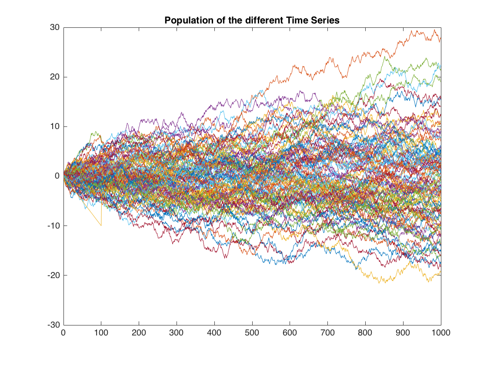
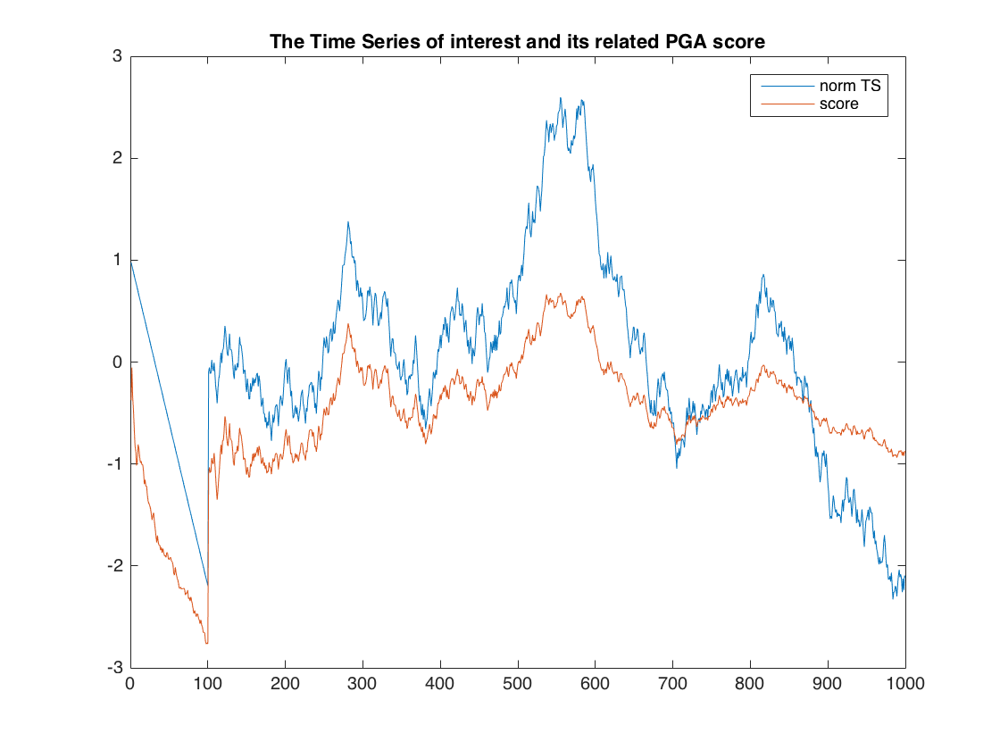

# Peer Group Analysis Clustering (Matlab)
Unsupervised Clustering of Time Series using Peer Group Analysis PGA

Peer group analysis is a new tool for monitoring behaviour over time in data mining
situations. In particular, the tool detects individual accounts that begin to behave in a 
way distinct from accounts to which they had previously been similar. Each account is
selected as a target account and is compared with all other accounts in the database, using
either external comparison criteria or internal criteria summarizing earlier behaviour
patterns of each account. Based on this comparison, a peer group of accounts most
similar to the target account is chosen. The behaviour of the peer group is then
summarized at each subsequent time point, and the behaviour of the target account
compared with the summary of its peer group. Those target accounts exhibiting
behaviour most different from their peer group summary behaviour are flagged as
meriting closer investigation. 

An example is provided below:

A bunch of time series is generated. The unconditional mean is 0.

We analyse the (normalised) time series in blue. At the beginning, it drops constantly before reverting back to the confidence intervals.
The score (shown in orange) is a t-statistics that summarises how far our time series is deviating from the equilibrium of the peer group.
Each time, the series is deviating from the confidence intervals (e.g. 90%, 95%), the score sharply increases. We can then flag those objects
with scores that deviate most substantially as worth of closer investigation (e.g. fraud detection).

